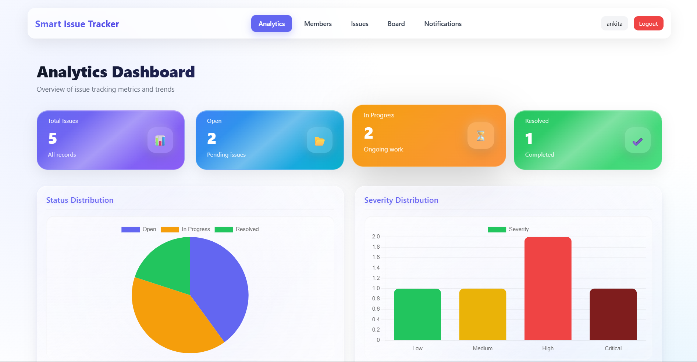
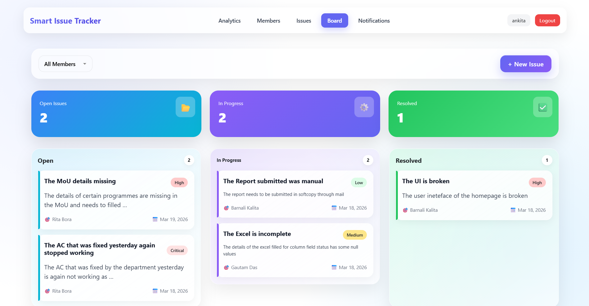
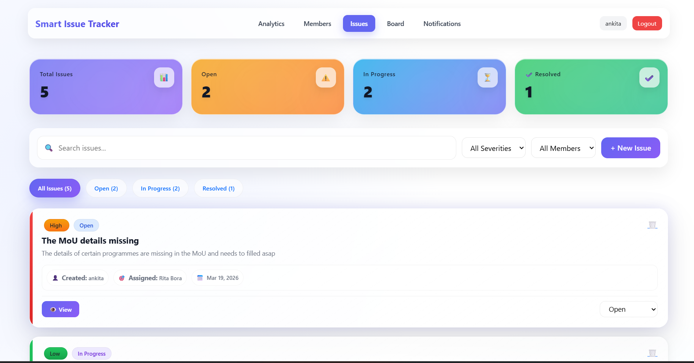
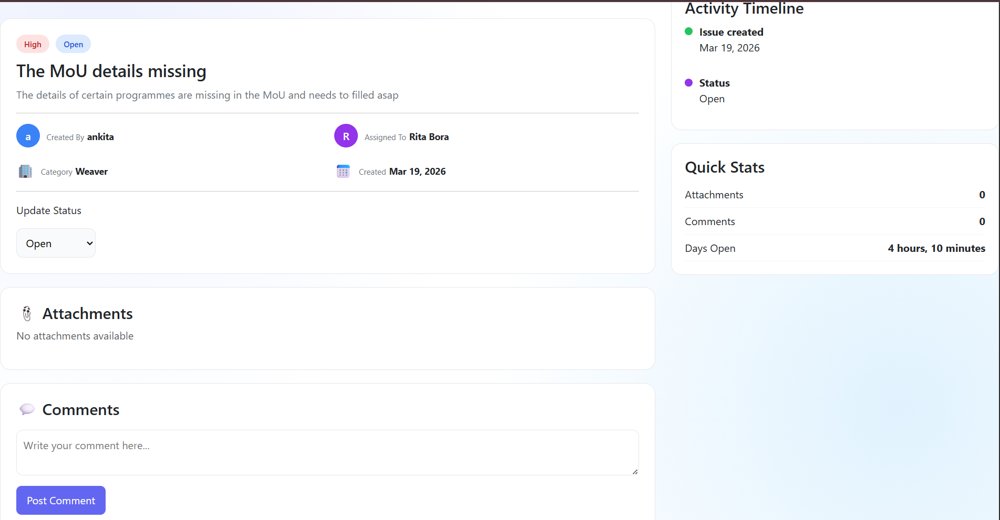
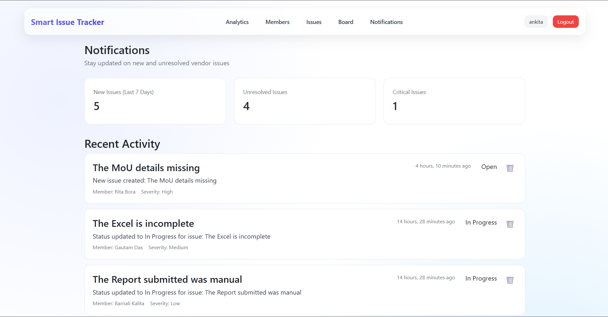
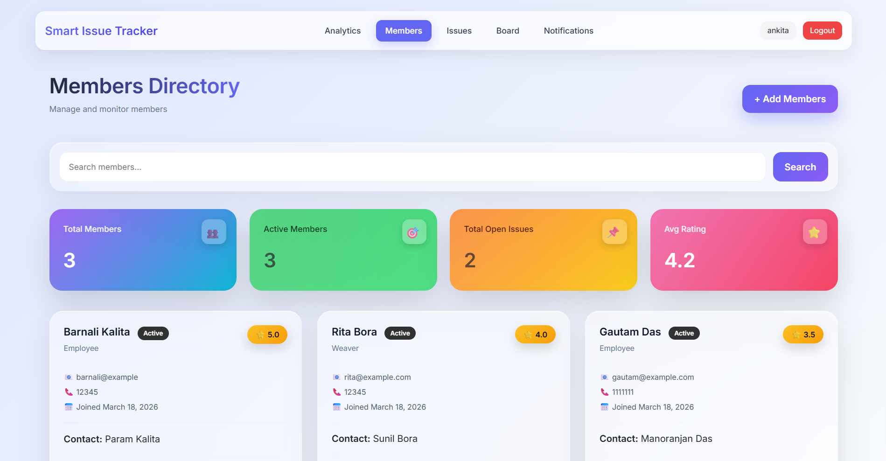

# 🚀 Smart Issue Tracker (In Progress)

A full-stack **Issue Tracking System** built with Django, designed to streamline task tracking, team collaboration, and issue analytics.

> ⚠️ This project is currently **under active development**. New features and improvements are being added continuously.

---

## 📌 Overview

Smart Issue Tracker is a centralized platform where teams can:

* Track issues across different stages
* Collaborate via comments
* Monitor performance through analytics
* Manage team members efficiently

The homepage features a **dynamic analytics dashboard** that provides real-time insights into issue status and team productivity.

---

## ✨ Features

### 📊 Analytics Dashboard (Homepage)

* Overview of issues:

  * Open
  * In Progress
  * Resolved
* Severity-wise distribution of issues
* Issues assigned per team member
* Trend chart showing issue patterns over time
* Live notification count

---

### 📝 Issue Management

* Create and manage issues
* Assign issues to team members
* Update issue status (Open / In Progress / Resolved)
* Attach files to issues
* Add comments on issues for collaboration

> ⚠️ **Issue details page is currently under development**

---

### 🔔 Notifications System

* Real-time notifications for:

  * Issue assignments
  * Status updates
  * Comments added
* Dedicated notifications page
* Live notification counter on dashboard

> ⚠️ **Notifications page is currently under development**

---

### 👥 Member Management

* View all team members
* Add new members
* Track issues assigned to each member

---

### 🔐 Authentication System

* User Signup
* User Login
* Secure access to system features

---

## 📸 Screenshots

### 📊 Dashboard

<p align="center">
  
</p>

### 🧩 Issue Board (Kanban View)

<p align="center">
  
</p>

### 📝 Issues Page

<p align="center">
  
</p>

### 📄 Issue Details

<p align="center">
  
</p>

### 🔔 Notifications

<p align="center">
  
</p>

### 👥 Members Page

<p align="center">
  
</p>

> ⚠️ Some sections (Issue Details & Notifications) are still under development and may change.

---

## 🛠️ Tech Stack

**Frontend:**

* HTML
* CSS
* Bootstrap

**Backend:**

* Django

**Database:**

* SQLite3 *(currently)*
* PostgreSQL *(planned for future)*

---

## 🚧 Upcoming Features

* 🔐 Role-Based Access Control (Admin / Member roles)
* 📜 Issue Activity Logs (audit trail for each issue)
* 🤖 Machine Learning Integration:

  * Automatic **issue severity prediction**
* 🗄️ Migration to PostgreSQL for production scalability
* UI/UX enhancements for a more premium experience

---

## 📂 Project Structure (Simplified)

```id="w6c9y1"
ISSUE-MANAGER/
│
├── accounts/
├── dashboard/
├── issue/
├── notifications/
├── vendors/
├── templates/
├── static/
├── manage.py
└── db.sqlite3 (ignored in Git)
```

---

## ⚙️ Setup Instructions

```bash id="f3g9lx"
git clone https://github.com/your-username/your-repo.git
cd your-repo

python -m venv env
env\Scripts\activate

pip install -r requirements.txt

python manage.py migrate
python manage.py runserver
```

---

## 🔒 Environment Variables

Create a `.env` file in the root directory:

```id="zq7y4c"
SECRET_KEY=your-secret-key
DEBUG=True
ALLOWED_HOSTS=127.0.0.1,localhost
```

---

## 📈 Project Status

* Core features implemented ✅
* UI enhancements in progress 🎨
* Advanced features (RBAC, ML, logs) planned 🚀

---

## 🤝 Contribution

This is currently a personal project, but suggestions and improvements are welcome.

---

## 📬 Contact

For queries or collaboration, feel free to reach out.

---

⭐ If you like this project, consider giving it a star!
